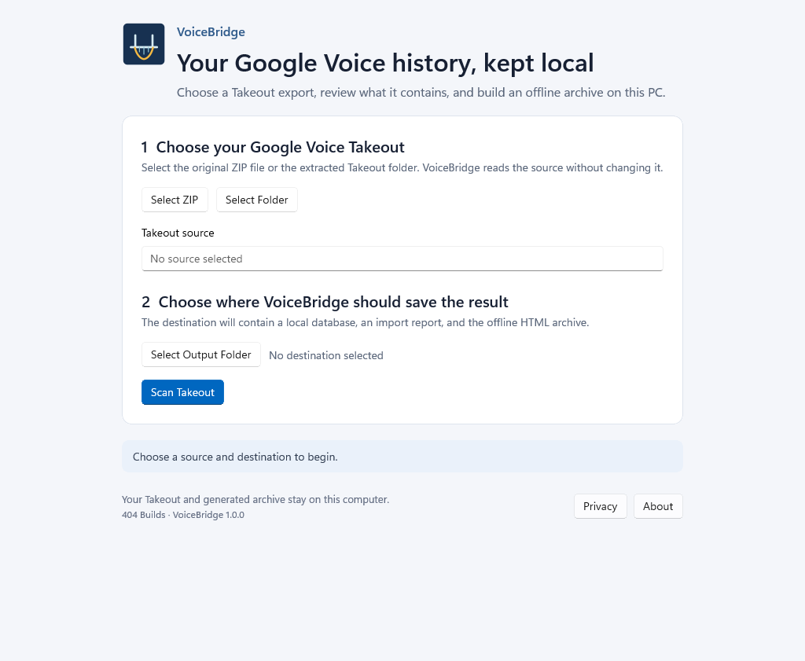
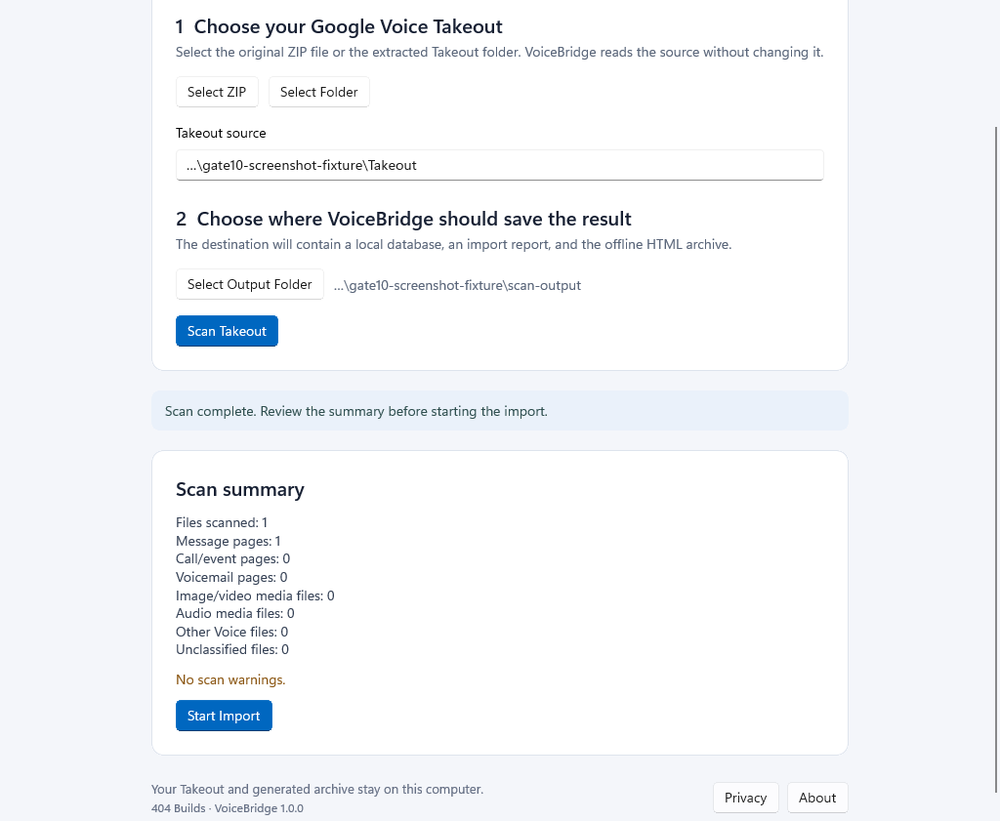
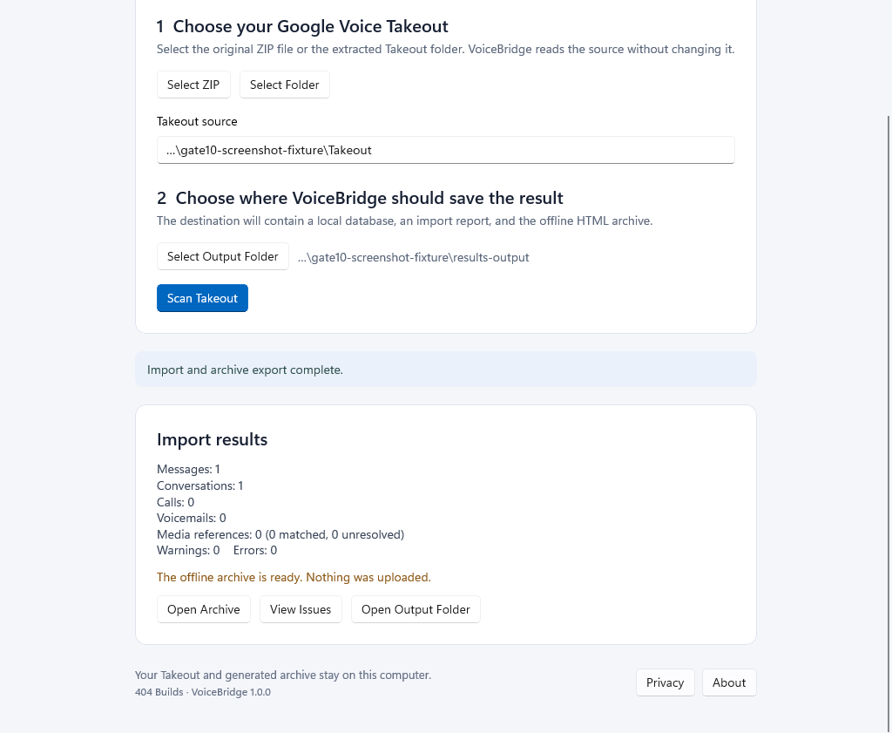

# VoiceBridge

VoiceBridge turns a Google Voice Takeout export into a local database, an import report, and an offline HTML archive you can browse on this PC. It keeps source rows and import issues visible so unsupported or ambiguous evidence is not silently dropped.

## Windows requirements

- 64-bit Windows 10, version 2004 (build 19041) or later, or Windows 11.
- About 93 MB to download the ZIP and 230 MB after extraction; an import needs additional free space based on the size of the Takeout and generated HTML archive.
- A Google Voice Takeout ZIP file, or a folder extracted from that ZIP.

The release package is a portable x64 ZIP. It includes the .NET and Windows App SDK runtime files needed by VoiceBridge. It does not require a separate VoiceBridge installer or administrator access.

See [the release strategy](release.md) for the distribution and signing trade-offs.

## Install and remove

1. Extract the VoiceBridge ZIP to a folder you control, such as `Documents\VoiceBridge`.
2. Run `VoiceBridge.exe` from that folder.
3. To remove the application, close VoiceBridge and delete the extracted application folder.

The application does not install a service or register an uninstaller. Removing its folder does not remove your Takeout, output folder, database, HTML archive, report, or any local crash log. Back up or remove those files separately if you want to.

## Create an archive

1. Select the original Takeout ZIP, or select the extracted Takeout folder.
2. Select an output folder outside the extracted source. Choose a destination that does not already contain VoiceBridge's `voicebridge.db`, `import-report.json`, or `archive` output.
3. Select **Scan Takeout** and review the counts and warnings. Unclassified files and scan warnings remain visible.
4. Select **Start Import**. You can cancel while work is in progress; any completed database or report remains in the destination.
5. When finished, select **Open Archive** to browse the generated `archive\index.html`, **View Issues** to review import details, or **Open Output Folder** to inspect all generated files.

The destination contains:

- `voicebridge.db` — imported records and their source evidence.
- `import-report.json` — counts, warnings, and issue details.
- `archive\` — a self-contained HTML archive for local browsing.
- `voicebridge-crash-*.txt` — only if an unhandled application failure is logged after a safe output folder has been selected.

Long source and destination paths are shortened in the window; hover over a path to see its full location.

## Screenshots

These screenshots show VoiceBridge using a synthetic one-message Takeout export. They contain no personal archive data.

## Privacy

VoiceBridge processes the selected files locally. The application does not use accounts, cloud processing, telemetry, or automatic uploads. It reads the selected Takeout without changing the source. See [the privacy statement](privacy.md) and the in-app **Privacy** button for details about local crash logs.

## Help

See [troubleshooting and support](support.md). Do not send your Takeout or generated database with a report unless you have reviewed it and intentionally chosen to share it; these files can contain private messages, phone numbers, and attachments.
